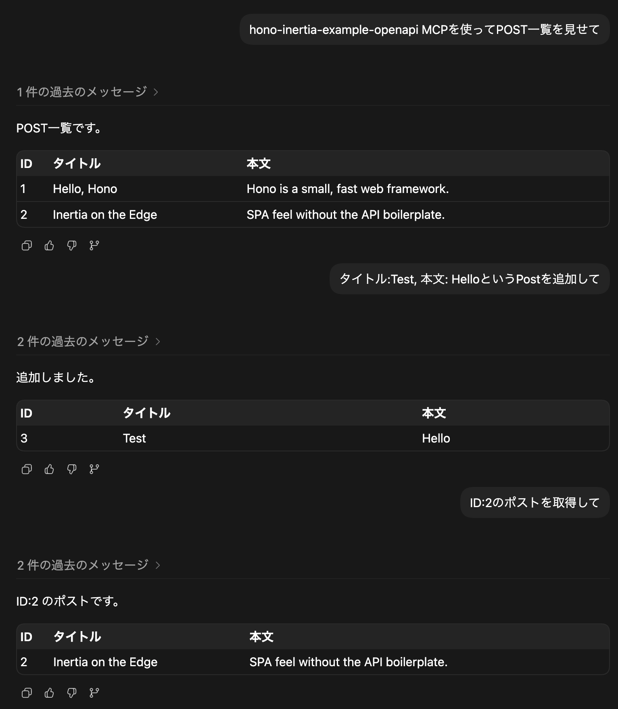

# Hono Inertia Example

Hono、Inertia、React、Viteで作る軽量フルスタックTypeScriptアプリの例です。

このリポジトリでは、人間がブラウザで使いやすいWebアプリでありつつ、AIやAPIクライアントからも扱いやすいアプリを構築する方法を示しています。

- ブラウザではInertia + ReactのUIとして動作します。
- APIやAIクライアントは、GETリクエストで `Accept: application/json` を指定すると同じルートからJSONを取得できます。
- JSON APIとして有用なルートはOpenAPIとして `/openapi.json` に公開されます。
- 必要であれば、OpenAPIをMCPに変換してCodexなどのAIツールから利用できます。

## Stack

- Hono: サーバーとルーティング
- Inertia + React: ブラウザ向けUI
- Vite: 開発サーバーとproduction build
- Zod: request/response schema
- hono-openapi: OpenAPI生成
- Node.js標準test runner: HTTPレベルのテスト

## Getting Started

```txt
npm install
npm run dev
```

Vite dev serverが起動します。表示されたローカルURLを開き、`/posts` にアクセスしてください。

## Production Build

```txt
npm run build
npm run start
```

production serverは `http://localhost:3000` で起動します。

## JSON API

posts画面は通常のInertia pageですが、APIやAIクライアント向けにplain JSONも返せます。

```txt
curl -H 'Accept: application/json' http://localhost:3000/posts
```

```txt
curl -H 'Accept: application/json' http://localhost:3000/posts/1
```

postの作成もJSONで行えます。

```txt
curl -i \
  -H 'Content-Type: application/json' \
  -H 'Accept: application/json' \
  -d '{"title":"Hello from curl","body":"Created through the JSON API."}' \
  http://localhost:3000/posts
```

サンプルデータはメモリ上に保持しているため、サーバーを再起動すると作成したpostはリセットされます。

## OpenAPI

OpenAPI documentは次のURLで取得できます。

```txt
http://localhost:3000/openapi.json
```

OpenAPIには、JSON APIとして意味のあるposts系ルートだけを載せています。`/posts/new` のようなUI専用ルートは、人間向け画面としては有用ですがAPIとしての価値は薄いため、OpenAPIからは除外しています。

## MCP for Codex

このリポジトリには、Codexが読めるproject-localなMCP設定を含めています。

```txt
.codex/config.toml
```

この設定はAWS LabsのOpenAPI MCP serverを使い、このアプリのOpenAPI documentをMCP toolsに変換します。使う前にアプリを起動してください。

```txt
npm run start
codex mcp list
```

MCP serverは次の値を参照します。

```txt
API_BASE_URL=http://localhost:3000
API_SPEC_URL=http://localhost:3000/openapi.json
INCLUDE_TAGS=Posts
```

これにより、OpenAPIから生成されたposts API toolsをCodexから利用できます。



## Scripts

```txt
npm run dev
npm run build
npm run start
npm test
npm run lint
npm run format
npm run format:check
```

## Project Layout

```txt
app/server.ts       Hono entry pointとtop-level routes
app/posts.ts        postsのdata、routes、schemas、OpenAPI route descriptions
app/pages/          Inertia React pages
src/renderer.tsx    Inertia rendererとJSON content negotiation
src/client.tsx      browser client bootstrap
test/http.test.mjs  Hono app.request()を使ったHTTP-level tests
```
